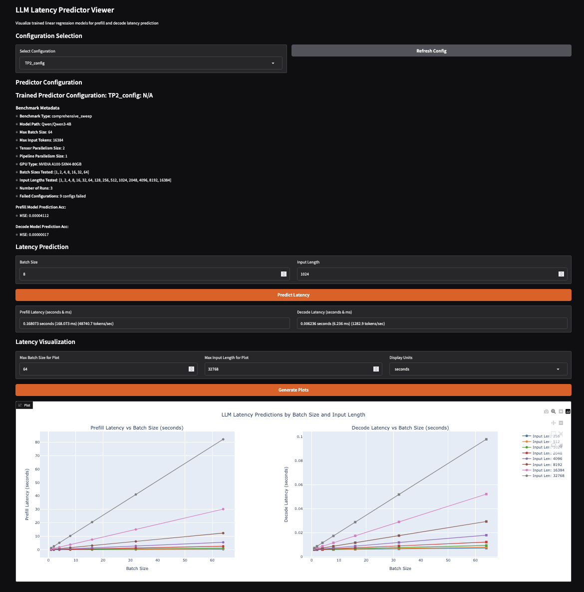

# LLM Execution Time Predictor

A small utility to help train a regression model given to predict prefill/decode times. 
By using the batch size and input, the prefill/decode execution times are very predictable.

This can be plugged into a simulator for faster experiments.

A more complicated version is done by https://github.com/microsoft/vidur but it trains every component of the model forwarding. This utility instead just profiles the full model forwarding as a unit to simplify research.

The tool https://modal.com/llm-almanac/advisor is nice visualizer but it doesn't let you train a local version and specify an exact bs/input

## Installation

### Option 1: Install from PyPI (Recommended)
```bash
pip install llm_execution_time_predictor
```

### Option 2: Install from Source
```bash
pip install -r requirements.txt
```

## Using Prefill/Decode execution time for predictors
A very small set of features are used to train the predictor.
Num new tokens: total tokens processed/generated:
- for decode, it's the batch size. for prefill, it's the full input chunk
Product ext cost: Represents the cost of attention
- For prefill, it's O(seq_len^2) so we do bs * input^2
- For decode, it's just O(seq_len)
Total context tokens: 
- Total tokens processed across batch * input representing the cache usage
Time of kernel

Tested on both prefill/decode the decode time 

## Usage

### Using the PyPI Package
```bash
# Profile a model and generate benchmark data
llm-execution-time-predictor profile <model_name> --tp_size <tp_size>

# Train models from benchmark data
llm-execution-time-predictor train_models <config_name> <benchmark_file> [--predictor-file <output_file>]

# Make predictions using trained models
llm-execution-time-predictor predict <predictor_file> <config_name> --mode <prefill/decode> --bs <batch_size> --input-len <input_length>

# View trained models and make interactive predictions (CLI)
llm-execution-time-predictor view [--predictor-file <predictor_file>]

# Launch web-based viewer with interactive plots
llm-execution-time-predictor webview [--predictor-file <predictor_file>] [--host <host>] [--port <port>]
```

### Using from Source
```bash
# Profile a model and generate benchmark data
python llm_execution_time_predictor/llm_forward_predictor_cli.py profile <model_name> --tp_size <tp_size>

# Train models from benchmark data
python llm_execution_time_predictor/llm_forward_predictor_cli.py train_models <config_name> <benchmark_file> [--predictor-file <output_file>]

# Make predictions using trained models
python llm_execution_time_predictor/llm_forward_predictor_cli.py predict <predictor_file> <config_name> --mode <prefill/decode> --bs <batch_size> --input-len <input_length>

# View trained models and make interactive predictions (CLI)
python llm_execution_time_predictor/llm_forward_predictor_cli.py view [--predictor-file <predictor_file>]

# Launch web-based viewer with interactive plots
python llm_execution_time_predictor/llm_forward_predictor_cli.py webview [--predictor-file <predictor_file>] [--host <host>] [--port <port>]
```

The trained predictor file format:
```json
{
    "config_name": {
        "prefill": {
            "weights": [0.1234, 0.5678, 0.9012, 0.3456],
            "bias": 0.0123,
            "model_type": "linear"
        },
        "decode": {
            "weights": [0.2345, 0.6789, 0.0123, 0.4567],
            "bias": 0.0456,
            "model_type": "linear"
        }
    }
}
```

Feature order: `[num_new_tokens, prod_ext_ctx, num_context_tokens, batch_size]`

## Webviewer


## Quickstart workflow

### Using PyPI Package
```bash
llm-execution-time-predictor profile Qwen/Qwen3-4B --tp_size 1
llm-execution-time-predictor train_models tp1_config benchmark_data_Qwen_Qwen3-4B_TP_1_PP_1.json --predictor-file trained_predictors.json
llm-execution-time-predictor predict trained_predictors.json tp1_config --mode decode --bs 8 --input-len 1024
llm-execution-time-predictor webview --predictor-file trained_predictors.json
```

### Using from Source
```bash
python llm_execution_time_predictor/llm_forward_predictor_cli.py profile Qwen/Qwen3-4B --tp_size 1
python llm_execution_time_predictor/llm_forward_predictor_cli.py train_models tp1_config benchmark_data_Qwen_Qwen3-4B_TP_1_PP_1.json --predictor-file trained_predictors.json
python llm_execution_time_predictor/llm_forward_predictor_cli.py predict trained_predictors.json tp1_config --mode decode --bs 8 --input-len 1024
python llm_execution_time_predictor/llm_forward_predictor_cli.py webview --predictor-file trained_predictors.json
```

# TODO
1. Fix vLLM force one batch
with vllm backend, currently vLLM might run more than 1 batch making some of the profiling innacurate skewing the model. Currently no good solution for this. 

# Ack
Co-contributors: [Dongming Li](https://github.com/dongmingli-Ben) and [Zijian He](https://github.com/jiange91)
